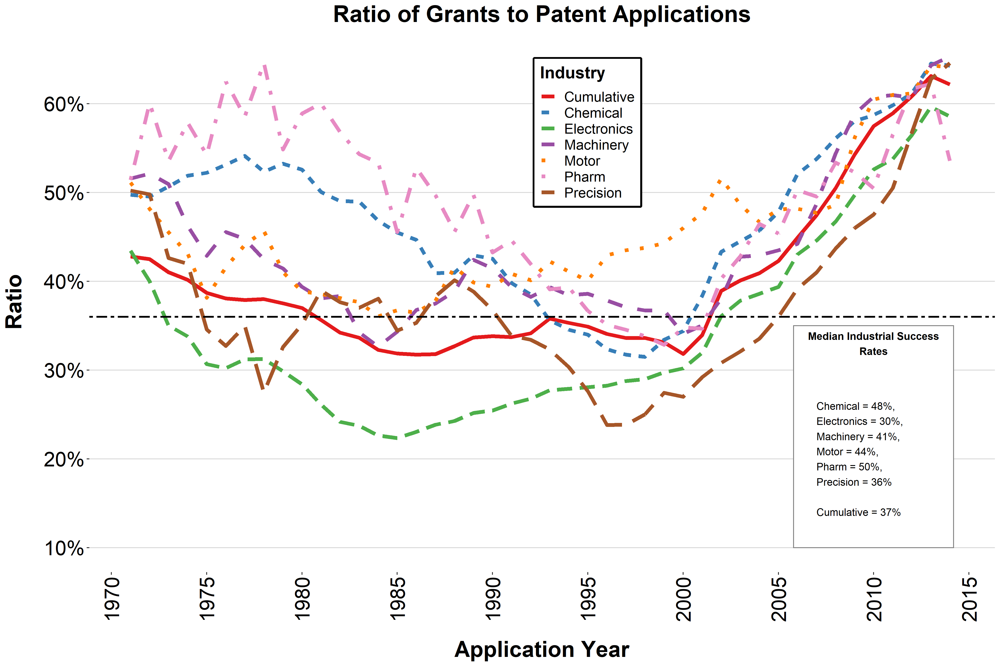
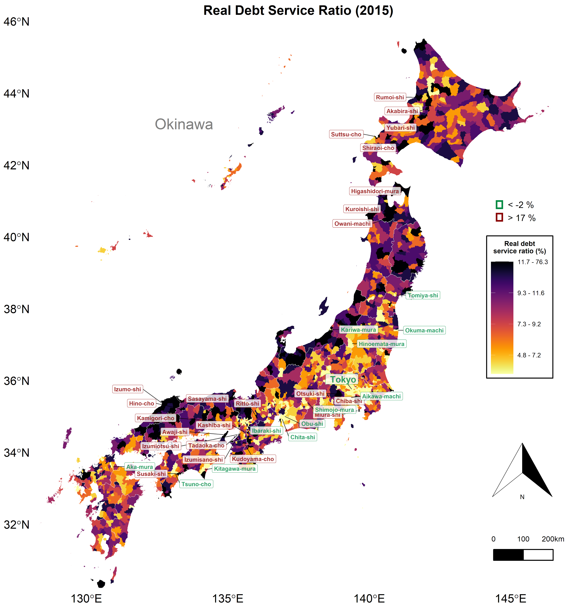
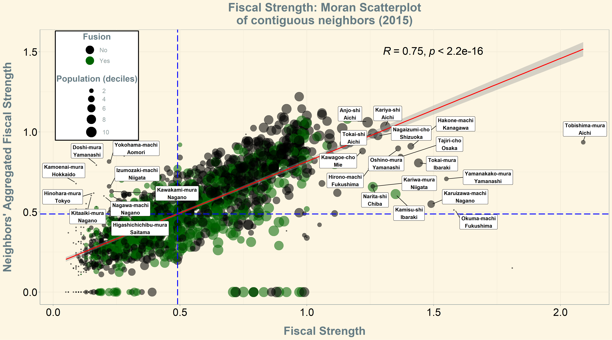
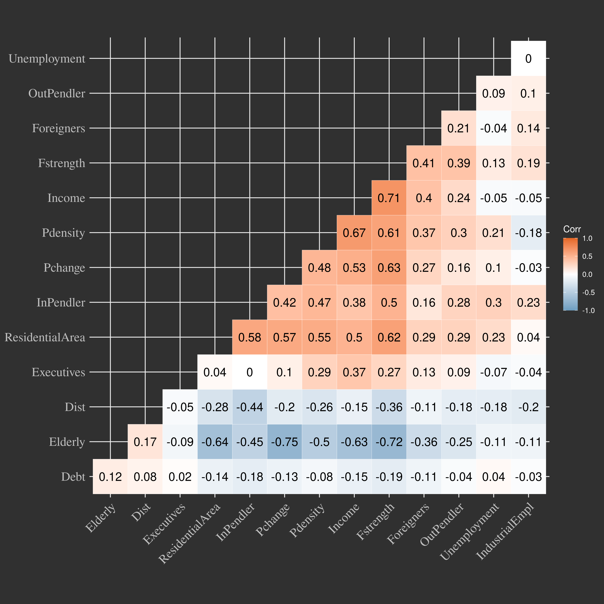
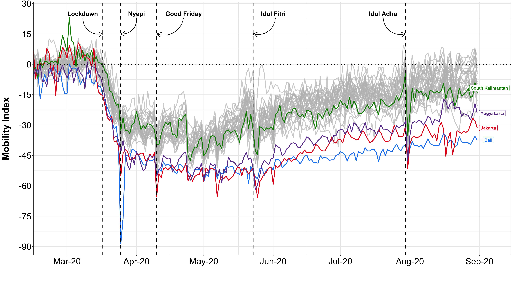

```{r setup, include=FALSE}
library(knitr)
#library(summarytools)
library(here)
library(ymlthis)
library(tidyverse)
library(fontawesome)
library(readr)
library(ggthemes)
library(ggpubr)
library(RColorBrewer)
library(kableExtra)
library(data.table)
library(metathis)
library(xaringanthemer)
library(xaringanExtra)
library(data.table)
library(RefManageR)
library(plm)
library(mgcv)
library(mgcViz)
library(stargazer)
library(plotly)
library(htmlwidgets)
library(modelsummary)

options(htmltools.dir.version = FALSE)
knitr::opts_chunk$set(collapse = TRUE,
                      fig.retina = 3)

```


```{r, load_refs, include=FALSE, cache=FALSE}

BibOptions(check.entries = FALSE,
           bib.style = "authoryear",
           cite.style = "alphabetic",
           style = "markdown",
           hyperlink = FALSE,
           dashed = FALSE)
myBib <- ReadBib(here("slides", "Dual-Market-OECD", "Labor-Dualism.bib"), check = FALSE)
```


```{r xaringan-extra, echo=FALSE}
 
xaringanExtra::use_scribble()
xaringanExtra::use_tile_view()
xaringanExtra::use_tachyons()
xaringanExtra::use_panelset()
xaringanExtra::use_share_again()
xaringanExtra::use_broadcast()
xaringanExtra::use_search(show_icon = TRUE)

xaringanExtra::style_share_again(
  foreground = "white",
  background = "black",
  share_buttons = c("twitter", "linkedin", "facebook")
)

# xaringanExtra::use_logo(
#   width = "220px",
#   height = "256px",
#   position = xaringanExtra::css_position(top = "2em", right = "2em"),
#   image_url = "assets/img/KUT.jpg",
#   exclude_class = "hide_logo"
# )

xaringanExtra::use_extra_styles(
  hover_code_line = TRUE,         #<<
  mute_unhighlighted_code = TRUE  #<<
)

xaringanExtra::use_progress_bar(
  color = "#0051BA", 
  location = "top", 
  height = "10px"
  )
```


#  My involevement with R: background

## Utilizing the benefits of an open-source software

.pull-left[
* Need for conducting statistical analysis


* Need for creating publishable-quality tables


* No access to paid statistical software


* Available free software:
  - limited scope of application
  - learning curve is unsustainable
]

--

.pull-right[

```{r echo=FALSE, include=TRUE, out.width = "120%", fig.align='center'}

```

]
---

## Benefiting from the range of visual tools

.pull-left[

```{r echo=FALSE, include=TRUE, out.width = "100%", fig.align='center'}

```

]

--

.pull-right[

```{r echo=FALSE, include=TRUE, out.width = "120%", fig.align='center'}

```

]

---

## Some more examples

.pull-left[

```{r echo=FALSE, include=TRUE, out.width = "100%", fig.align='center'}

```

]

--

.pull-right[

```{r echo=FALSE, include=TRUE, out.width = "100%", fig.align='center'}

```

]

---

## Websites' production

.pull-left[

```{r echo=FALSE, fig.cap = '<a href="https://dual-market.netlify.app/" style="color:Black;">"Labor Market Dualism in the International Context"</a>'}
knitr::include_url("https://dual-market.netlify.app/")
```

]


--

.pull-right[

```{r echo=FALSE, fig.cap = '<a href="https://r-intro-tuebingen.netlify.app/" style="color:Black;">"Basic Data Analysis in R for Social Sciences"</a>'}
knitr::include_url("https://r-intro-tuebingen.netlify.app/")
```

]

---

# Getting started with R

.pull-left[


```{r echo=FALSE, fig.cap = '<a href="https://jennhuck.github.io/workshops/install_update_R.html" style="color:Black;">Install or Update R</a>'}
knitr::include_url("https://jennhuck.github.io/workshops/install_update_R.html")
```
]

--

.pull-right[

```{r echo=FALSE, fig.cap = '<a href="https://bookdown.org/daniel_dauber_io/r4np_book/the-rstudio-interface.html" style="color:Black;">RStudio interface</a>'}
knitr::include_url("https://bookdown.org/daniel_dauber_io/r4np_book/the-rstudio-interface.html")
```

]